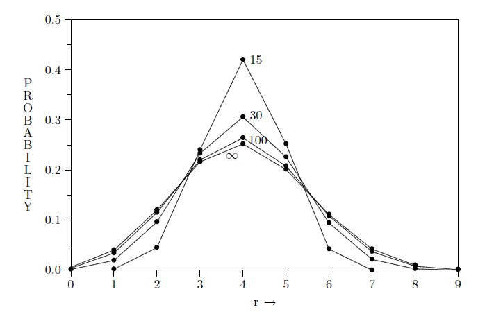

== 3.7 The binomial distribution 二项分布

Although somewhat complicated mathematically, the hypergeometric distribution arises from a problem that is very clear and simple conceptually; there are only a finite number of possibilities and all the above results are exact for the problems as stated. As an introduction to a mathematically simpler, but conceptually far more difficult, problem, we examine a limiting form of the hypergeometric distribution.

虽然在数学上有些复杂，但是超几何分布源于一个在概念上非常清晰和简单的问题;全部的概率的个数是有限的，所有上述结果对于所述问题都是准确的。为了介绍这个数学上更简单但在概念上更加困难的问题，我们研究一下超几何分布的极限形式。

The complication of the hypergeometric distribution arises because it is taking into account the changing contents of the urn; knowing the result of any draw changes the probability for red for any other draw. But if the number N of balls in the urn is very large compared with the number drawn (N >> n), then this probability changes very little, and in the limit N →∞ we should have a simpler result, free of such dependencies. To verify this, we write the hypergeometric distribution (3.22) as

超几何分布的复杂性的原因来自于它要考虑到盒中球的变化;知道任何一次抽取的结果都将改变其他任何某次抽到的红球的概率。但是如果与抽取次数n相比，盒中球的总数N非常大（N>>n），那么这个概率的变化会很小，在极限情况N→∞中我们将不需要考虑这个变化,并得到一个更简单的结果。为了验证这一点，我们将超几何分布（3.22）写为

 $$h(r|N,M,n) = \frac {[ \frac{1}{N^r} \binom {M}{r}] [ \frac {1}{N^{n-r}} ( \binom {N-M}{n-r} ) ] } { \frac {1}{N^n} \binom {N}{n} ] } $$. (3.81)

The first factor is

第一个因子是

 $$\frac {1}{N^r} \binom {M} {r} = \frac {1}{r!} \frac {M}{N} (\frac M N − \frac 1 N) (\frac M N − \frac 2 N) ··· ( \frac M N − \frac {r−1}{N}) $$ , (3.82)

and in the limit N →∞, M →∞, M/N → f , we have

极限情况,当N→∞,M→∞, M/N→f,有

 $$\frac {1}{N_r} \binom {M}{r} → \frac {f^r} {r!} $$. (3.83)

Likewise,

类似的,

 $$\frac {1}{N^{n−r}} \binom {M−1}{n−r} → \frac {(1−f)^{n−r}} {(n−r)!} $$, (3.84)
 $$\frac {1}{N^n} \binom {N}{n} → \frac {1}{n!} $$. (3.85)

In principle, we should, of course, take the limit of the product in (3.81), not the product of the limits. But in (3.81) we have defined the factors so that each has its own independent limit, so the result is the same; the hypergeometric distribution goes into

原则上,我们显然应该对（3.81）的积求限制，而不是对极限的求积。但是在（3.81）中我们已经定义了因子，因此每个因子都有自己独立的极限，因此两者的结果相等; 超几何分布变为

 $$h(r|N,M,n) → b(r|n,f) ≡ \binom {n}{r} f^r (1 − f )^{n−r}$$ (3.86)

called the binomial distribution, because evaluation of the generating function (3.24) now reduces to

称为二项分布，因为生成函数（3.24）的评估现在规约为

 $$G(t) ≡ \sum_{r=0}^n b(r|n,f)t^r = (1 − f + ft)^n, $$   (3.87)

an example of Newton’s binomial theorem.

即牛顿二项式定理的一个例子.

Figure 3.1 compares three hypergeometric distributions with N = 15, 30, 100 and M/N = 0.4, n = 10 to the binomial distribution with n = 10, f = 0.4. All have their peak at r = 4, and all distributions have the same first moment $$\langle r \rangle$$ = E(r) = 4, but the binomial distribution is broader.

图3.1比较了三个超几何分布，分别是N=15,30,100且M/N=0.4，还有n=10且n=10且f=0.4的二项式分布。所有的分布在r=4处都有峰值，并且所有分布都具有相同的一阶矩$$\langle r \rangle$$=E(r)=4，但二项分布变得更宽了。

The N = 15 hypergeometric distribution is zero for r = 0 and r > 6, since on drawing ten balls from an urn containing only six red and nine white, it is not possible to get fewer than one or more than six red balls. When N > 100 the hypergeometric distribution agrees so closely with the binomial that for most purposes it would not matter which one we used. Analytical properties of the binomial distribution are collected in Chapter 7. In Chapter 9 we find, in connection with significance tests, situations where the binomial distribution is exact for purely combinatorial reasons in a finite sample space, Eq. (9.46).

当r=0且r>6，N=15的超几何分布为零，因为在从包含6个红球和9个白球的盒中取出10个球时，不可能有少于一个或多于六个红球。当N>100时，超几何分布与二项式足够近似，以至于在大多数情况下，使用哪一个都不重要。二项式分布的分析性质在第7章中讨论。在第9章中，我们发现，在显著性测试中,二项分布在有限样本空间中由于存粹的组合原因而能准确计算，等式（9.46）。

We can carry out a similar limiting process on the generalized hypergeometric distribution (3.75). It is left as an exercise to show that in the limit where all $$N_i →∞$$in such a way that the fractions

我们可以对广义超几何分布(3.75)进行类似的求极限限制过程。这个可留作一个练习，以说明在这种方式下,当所有$$N_i→∞$$时的极限时,分数

 $$f_i ≡ \frac {N_i}{\sum N_j} $$(3.88)

tend to constants, (3.75) goes into the multinomial distribution

将趋向于常数,(3.75)变为多项式分布

 $$m(r_1···r_k|f_1 ··· f_k ) = \frac {r!} {r_1! ··· r_k!} f_1^{r1} ··· f_k^{rk}$$ , (3.89)

where $$r ≡ \sum ri$$ . And, as in (3.87), we can define a generating function of (k − 1) variables, from which we can prove that (3.89) is correctly normalized and derive many other useful results.

其中$$r≡\​​sum ri$$。并且，如在（3.87）中，我们可以定义（k-1）个变量的生成函数，从中我们可以证明（3.89）被正确地归一化,并导出许多其他有用的结果。

Exercise 3.2. Suppose an urn contains $$N = \sum N_i$$ balls, $$N_1$$ of color 1, $$N_2$$ of color 2, . . . , $$N_k$$ of color k. We draw m balls without replacement; what is the probability that we have at least one of each color? Supposing k = 5, all $$N_i=10$$, how many do we need to draw in order to have at least a 90% probability for getting a full set?

练习3.2。假设盒中有$$ N = \sum N_i $$个球，颜色1的有$$N_1$$个，颜色2的有$$N_2$$ ... ，颜色$$N_k$$的有k个。我们取出m个球且取出后不再放回去;至少每种颜色至少有一个求的概率是多少？假设k=5，所有$$N_i=10$$，我们需要取多少次,获得所有颜色的球的概率达到90％以上？

Exercise 3.3. Suppose that in the previous exercise k is initially unknown, but we know that the urn contains exactly 50 balls. Drawing out 20 of them, we find three different colors; now what do we know about k? We know from deductive reasoning (i.e. with certainty) that 3 ≤ k ≤ 33; but can you set narrower limits $$k_1 ≤ k ≤ k_2$$ within which it is highly likely to be?

练习3.3。假设上一个练习中k是未知的，但我们知道盒中共有50个球。抽出20个，我们发现了三种不同的颜色;现在我们对k能知道什么？我们从演绎推理（即绝对确定）知道应有3≤k≤33;但是你能缩小范围限制$$k_1≤k≤k_2$$并且有很高的可信度吗？

Hint: This question goes beyond the sampling theory of this chapter because, like most real scientific problems, the answer depends to some degree on our common sense judgments; nevertheless, our rules of probability theory are quite capable of dealing with it, and persons with reasonable common sense cannot differ appreciably in their conclusions.

提示：这个问题超出了本章的抽样理论，因为像大多数真正的科学问题一样，答案在某种程度上取决于我们的常识判断;尽管如此，我们的概率论规则处理这种问题的能力很强，而具有合理常识的人确不能看出他们的结论之间有什么明显的差别。

Exercise 3.4. The M urns are now numbered 1 to M, and M balls, also numbered  1 to M, are thrown into them, one in each urn. If the numbers of a ball and its urn are the same, we have a match. Show that the probability for at least one match is

练习3.4。有M个盒子编号为1到M，并且有M球（也编号为1到M）,然后将球扔到盒中，每个盒中一个。如果球和它所在的盒的标号相同，我们说这是一个匹配。那么至少有一个匹配的概率为

 $$h = \sum_{k=1}{M} (−1)^{k+1}/k!$$ (3.90)

As M →∞, this converges to 1 − 1/e = 0.632. The result is surprising to many, because, however large M is, there remains an appreciable probability for no match at all.

当M→∞时，上式收敛为1-1/e=0.632。结果让许多人感到惊讶，因为无论M是多么大，完全没有任何匹配的概率总是存在的(不是无穷小)。

Exercise 3.5. N balls are tossed into M urns; there are evidently $$M^N$$ ways this can be done. If the robot considers them all equally likely, what is the probability that each urn receives at least one ball?

练习3.5。 N个球被扔进M个盒中;显然有$$M^N$$种方式可以做到这一点。如果机器人认为所有这些发生的可能性都一样，那么每个盒中至少接收一个球的概率是多少？
